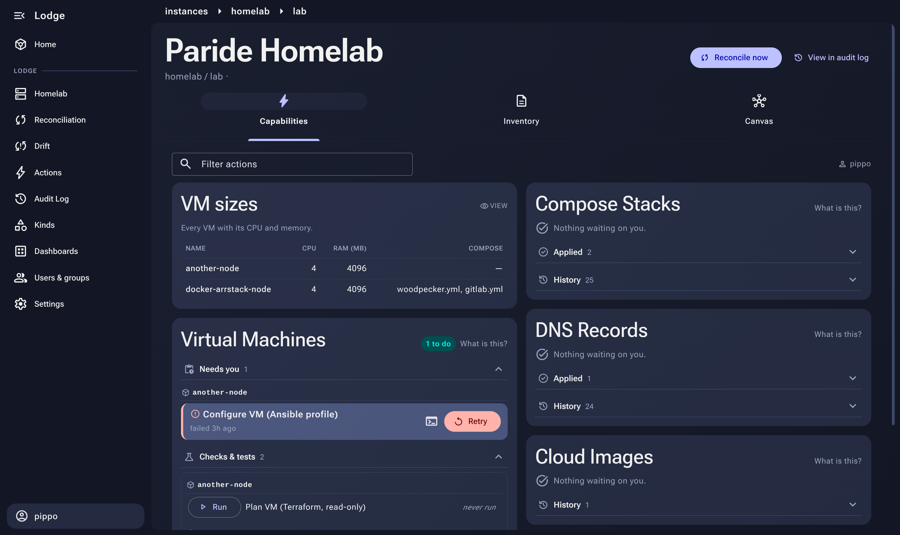

# Lodge

**A blank canvas for operations.** You describe your systems in plain files, the way you
think about them. Lodge keeps reality in line with that description, and asks you before
it does anything that matters.



## The idea, in three steps

**1. Write down how things should be.** A folder of YAML files in a Git repository. What
goes in it is up to you: virtual machines, DNS records, customer environments,
certificates. Lodge has no built-in notion of any of them.

```yaml
# inventory/homelab/instances/lab/instance.yaml
proxmox:
  virtual_machines:
    another-node: { cores: 4, memory_mb: 4096, ip: 192.168.178.115/24 }
```

**2. Say what can be done about it.** Next to the description, you define what happens
when something appears, changes or disappears, and who is allowed to make it happen.
The work itself is a container (a Terraform, Ansible or any other script you put in the
same folder) or an HTTP call to a system that already knows how.

```yaml
# inventory/homelab/capabilities/virtual_machines.yaml
signals:
  - path: proxmox.virtual_machines
    kind: keyed_collection
    rules:
      - on: add
        actions:
          - key: apply_vm
            label: "Create VM (Terraform)"
            policy: MANUAL_REQUIRED          # wait for a human
            executor: docker
            docker: { build: { context: playbooks/terraform }, command: ["apply"] }
      - on: delete
        actions:
          - key: destroy_vm
            label: "Destroy VM (Terraform)"
            policy: MANUAL_REQUIRED
            requires: admins                 # and only these humans
            # ...
```

**3. Let Lodge watch the gap.** Lodge continuously compares what you wrote with what has
actually been done. Every difference becomes an **action**: some run on their own,
others wait in the UI for the right person to approve them. Every step is logged.
Change the file, and the actions follow; once reality matches the description, they
disappear.

That's the whole model. Your files are the canvas, and Lodge supplies the rules that keep
it honest: Git is the only source of truth, every change goes through an action, every
action has a policy and an owner, and every run is recorded.

If you know Kubernetes, this is the operator pattern without the cluster and without
writing a controller, with a human in the loop. If you know Terraform, it's a `plan` that
never stops running, over anything you can describe, where every line of the plan is a
button with permissions and an audit trail. The web UI and the `lodge` CLI are equal
clients of the same API.

**→ [docs/VISION.md](docs/VISION.md)** goes deeper: why it's built this way, the full
vocabulary, a worked example, and how it compares to tools you may already know.

## Getting started

### Prerequisites

The scripts never install anything: they check each tool is present at the pinned
version and stop if it isn't.

| Tool | Version | Pinned in |
|------|---------|-----------|
| Docker Engine + compose plugin | any recent | — |
| .NET SDK | `10.0.100` (or a later `10.0.1xx` feature band) | `global.json` |
| Node.js | `22.23.1`, exactly | `ui/.nvmrc` |
| [process-compose](https://github.com/F1bonacc1/process-compose) | any recent | — |

<details>
<summary>Install commands</summary>

```bash
# Docker: https://docs.docker.com/engine/install/ — then let your user talk to the daemon
sudo usermod -aG docker "$USER"   # log out and back in afterwards

# .NET SDK, via Microsoft's install script (or your distro's package, if it ships 10.0.1xx)
curl -fsSL https://dot.net/v1/dotnet-install.sh -o /tmp/dotnet-install.sh
bash /tmp/dotnet-install.sh --version 10.0.100 --install-dir "$HOME/.dotnet"
# add to your shell profile:  export DOTNET_ROOT="$HOME/.dotnet"; export PATH="$HOME/.dotnet:$PATH"

# Node, via nvm (https://github.com/nvm-sh/nvm) — any version manager works, as long as
# `node --version` matches ui/.nvmrc when the scripts run
curl -fsSL https://raw.githubusercontent.com/nvm-sh/nvm/v0.40.1/install.sh | bash
(cd ui && nvm install)            # reads ui/.nvmrc

# process-compose, via its official installer, into ~/.local/bin
sh -c "$(curl --location https://raw.githubusercontent.com/F1bonacc1/process-compose/main/scripts/get-pc.sh)" -- -d -b "$HOME/.local/bin"
```

When you bump a pin (`global.json`, `ui/.nvmrc`), install the new version the same way;
the scripts refuse to start until you do. With nvm they switch to the pinned Node on their
own; with any other manager, switch before running them.

</details>

### Run it locally

```bash
./scripts/run.sh
```

Starts the dev Postgres (`docker-compose.yml`), the server and the UI dev server under
process-compose, each with its own log. The server migrates its own schema on first boot.
Open `http://localhost:4200`.

```bash
./scripts/run.sh            # quitting the TUI leaves the stack running; re-run to reattach
./scripts/run.sh --stop     # stop everything (data stays in ./data/postgres)
./scripts/dev-db-up.sh      # just the dev Postgres, e.g. to run the server from an IDE
./scripts/dev-db-down.sh    # remove the Postgres container (--wipe also deletes its data)
./scripts/prod-test.sh      # build the server image and run the production stack locally
```

### Run it for real

One container (API + UI + schema migrations) plus Postgres, and optionally Keycloak for
SSO. Copy `.env.prod.example` to `.env.prod`, fill in every `CHANGEME`, then:

```bash
docker compose -f docker-compose.prod.yml --env-file .env.prod up -d
```

This pulls `ghcr.io/jasoc/lodge` (published by the manual `docker-publish` workflow);
add `--build` to build it from the checkout instead. Two complete setups are written up
in [docs/deployment/homelab.md](docs/deployment/homelab.md) (no auth, one host) and
[docs/deployment/company.md](docs/deployment/company.md) (SSO, groups gating actions,
service tokens for CI).

## What's in the repo

- `inventory/homelab/`: a working example. Proxmox VMs created and destroyed with
  Terraform and configured with Ansible, compose stacks, DNS records and cloud images,
  all defined in YAML with their playbooks alongside. Replace it with your own: nothing
  in the code knows about it.
- `server/`: the .NET backend (domain and reconciler, infrastructure, the ASP.NET Core
  host serving both the API and the built UI).
- `ui/`: the Angular SPA.
- `cli/`: the `lodge` command-line client.
- `migrations/`: the Postgres schema, applied by the server on every startup.
- `docs/VISION.md`: what Lodge is and why. Start here.
- `docs/AGENTS.md`: the technical reference (vocabulary, invariants, extension points).
  Read it before changing code.

## License

See [LICENSE](LICENSE).
